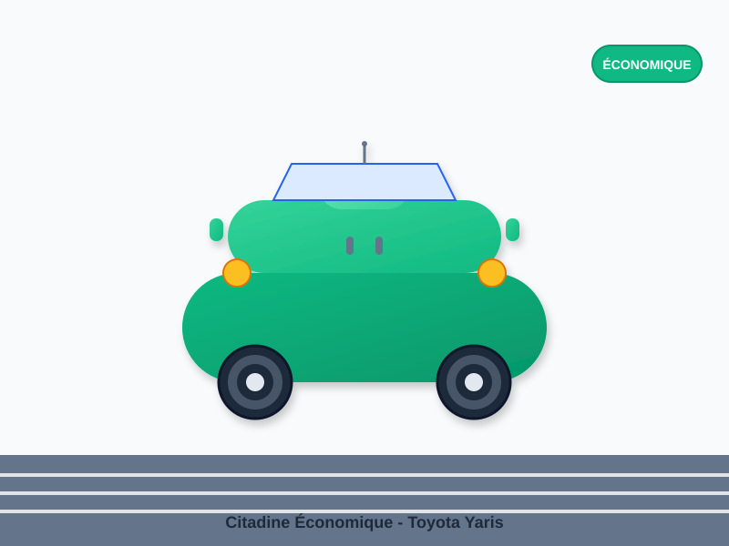

# 🎬 Démonstration Images et Vidéo - AutoLoc Bénin

## 🖼️ Images SVG Créées

### ✅ **Logo AutoLoc Bénin**
- **Fichier** : `media/images/logo/autoloc-benin-logo.svg`
- **Caractéristiques** : Logo vectoriel avec voiture stylisée
- **Couleurs** : Dégradé bleu avec ombres
- **Utilisation** : Header, footer, favicon

### ✅ **Citadine Économique**
- **Fichier** : `media/images/vehicles/citadine-economique.svg`
- **Style** : Voiture verte moderne avec route
- **Détails** : Phares, vitres, roues avec jantes
- **Badge** : "ÉCONOMIQUE" intégré

## 🎥 Vidéo d'Accueil à Créer

### 📹 **Spécifications Techniques**
- **Durée** : 30 secondes maximum
- **Résolution** : 1920x1080 (Full HD)
- **Format** : MP4 (H.264) + WebM
- **Taille** : < 10MB pour le web

### 🎬 **Contenu Recommandé**

#### **Séquence 1 (0-5s) : Introduction**
- Logo AutoLoc Bénin avec animation
- Titre : "Location de Voitures au Bénin"
- Sous-titre : "Qualité, Sécurité, Service Premium"

#### **Séquence 2 (5-15s) : Présentation des Véhicules**
- Montage de voitures de luxe en mouvement
- Différents types de véhicules (citadine, SUV, berline)
- Images de Cotonou en arrière-plan

#### **Séquence 3 (15-25s) : Services**
- Livraison à domicile
- Assurance tous risques
- Support 24/7
- Réservation en ligne

#### **Séquence 4 (25-30s) : Call-to-Action**
- "Réservez maintenant"
- Numéro de téléphone : +229 21 30 12 34
- Site web : www.autoloc-benin.bj
- Logo final

### 🎵 **Musique et Audio**
- **Style** : Électronique moderne ou jazz lounge
- **Tempo** : Modéré (120-140 BPM)
- **Ambiance** : Professionnelle et accueillante
- **Sources** : YouTube Audio Library (gratuit)

## 🛠️ Outils de Création

### **Gratuits (Recommandés pour débuter)**
1. **DaVinci Resolve** : Édition professionnelle gratuite
2. **OpenShot** : Édition simple et intuitive
3. **Canva** : Création de vidéos en ligne
4. **CapCut** : Édition mobile avancée

### **Payants (Professionnels)**
1. **Adobe Premiere Pro** : Standard de l'industrie
2. **Final Cut Pro** : Mac uniquement
3. **Camtasia** : Capture et édition

## 📱 **Comment Créer la Vidéo**

### **Étape 1 : Préparation**
1. **Collectez** vos images de véhicules
2. **Préparez** le script et storyboard
3. **Choisissez** la musique d'accompagnement
4. **Organisez** vos fichiers médias

### **Étape 2 : Création**
1. **Importez** vos images et vidéos
2. **Créez** les séquences selon le storyboard
3. **Ajoutez** la musique et les transitions
4. **Intégrez** le logo et les textes

### **Étape 3 : Export**
1. **Résolution** : 1920x1080 (Full HD)
2. **Format** : MP4 (H.264)
3. **Qualité** : Optimisée pour le web
4. **Taille** : < 10MB

## 🖼️ **Images SVG Supplémentaires à Créer**

### **Véhicules**
- [ ] `suv-familial.svg` - SUV moderne et spacieux
- [ ] `berline-premium.svg` - Berline de luxe élégante

### **Services**
- [ ] `livraison-domicile.svg` - Service de livraison
- [ ] `assurance-risques.svg` - Protection et sécurité
- [ ] `support-24-7.svg` - Service client
- [ ] `reservation-en-ligne.svg` - Plateforme digitale

### **Galerie**
- [ ] `voiture-luxe-1.svg` - Voiture de luxe
- [ ] `suv-moderne-1.svg` - SUV moderne
- [ ] `berline-elegante-1.svg` - Berline élégante
- [ ] `voiture-sportive-1.svg` - Voiture sportive
- [ ] `4x4-terrain-1.svg` - 4x4 tout-terrain
- [ ] `voiture-ville-1.svg` - Voiture de ville

## 🎯 **Utilisation des Images SVG**

### **Avantages**
- ✅ **Scalable** : Qualité parfaite à toutes les tailles
- ✅ **Léger** : Fichiers de petite taille
- ✅ **Modifiable** : Facile à personnaliser
- ✅ **Performant** : Chargement rapide

### **Intégration HTML**
```html
<!-- Image SVG dans une carte de véhicule -->
<div class="vehicle-image">
    
    <div class="vehicle-badge">Économique</div>
</div>
```

### **Intégration CSS**
```css
.vehicle-img {
    width: 100%;
    height: 250px;
    object-fit: cover;
    transition: transform 0.3s ease;
}

.vehicle-img:hover {
    transform: scale(1.1);
}
```

## 🚀 **Déploiement sur Hostinger**

### **Structure des Dossiers**
```
public_html/
├── index.html
├── styles.css
├── script.js
├── config.js
└── media/
    ├── images/
    │   ├── logo/
    │   ├── vehicles/
    │   ├── services/
    │   └── gallery/
    └── videos/
        └── hero-video.mp4
```

### **Upload des Fichiers**
1. **Créez** la structure de dossiers
2. **Uploadez** tous les fichiers SVG
3. **Ajoutez** votre vidéo d'accueil
4. **Testez** le site en ligne

## 📊 **Performance et Optimisation**

### **Images SVG**
- **Taille** : Généralement < 50KB
- **Chargement** : Instantané
- **Cache** : Excellent pour le navigateur
- **SEO** : Texte accessible et indexable

### **Vidéo MP4**
- **Compression** : H.264 optimisé
- **Lazy Loading** : Chargement intelligent
- **Fallback** : Image statique si vidéo ne charge pas
- **Mobile** : Désactivée sur appareils à faible performance

## 🎨 **Personnalisation des Images**

### **Couleurs de Marque**
- **Principal** : #2563eb (Bleu)
- **Secondaire** : #10b981 (Vert)
- **Accent** : #fbbf24 (Or)
- **Neutre** : #64748b (Gris)

### **Style Visuel**
- **Moderne** : Formes géométriques
- **Professionnel** : Dégradés subtils
- **Cohérent** : Même palette partout
- **Attrayant** : Ombres et effets

## 📝 **Checklist de Production**

### **Images SVG**
- [ ] Logo principal créé
- [ ] Images de véhicules (3)
- [ ] Images de services (4)
- [ ] Images de galerie (6)
- [ ] Optimisation des fichiers

### **Vidéo d'Accueil**
- [ ] Script écrit et validé
- [ ] Storyboard créé
- [ ] Médias collectés
- [ ] Montage effectué
- [ ] Export optimisé
- [ ] Tests sur différents appareils

### **Intégration**
- [ ] Fichiers uploadés sur Hostinger
- [ ] Chemins corrects dans le code
- [ ] Fallbacks configurés
- [ ] Performance testée
- [ ] Responsive design vérifié

---

## 🌟 **Résultat Final**

Avec ces images SVG et votre vidéo d'accueil, votre site AutoLoc Bénin aura :

- **🎨 Design professionnel** et cohérent
- **📱 Performance optimale** sur tous les appareils
- **🚀 Chargement rapide** pour une meilleure expérience utilisateur
- **🔍 SEO optimisé** avec des images accessibles
- **💼 Image de marque** forte et mémorable

---

**Votre site sera maintenant visuellement attractif et professionnel ! 🎬✨**

**Prochaine étape** : Créez votre vidéo d'accueil et ajoutez les images SVG manquantes pour un site complet et impressionnant.