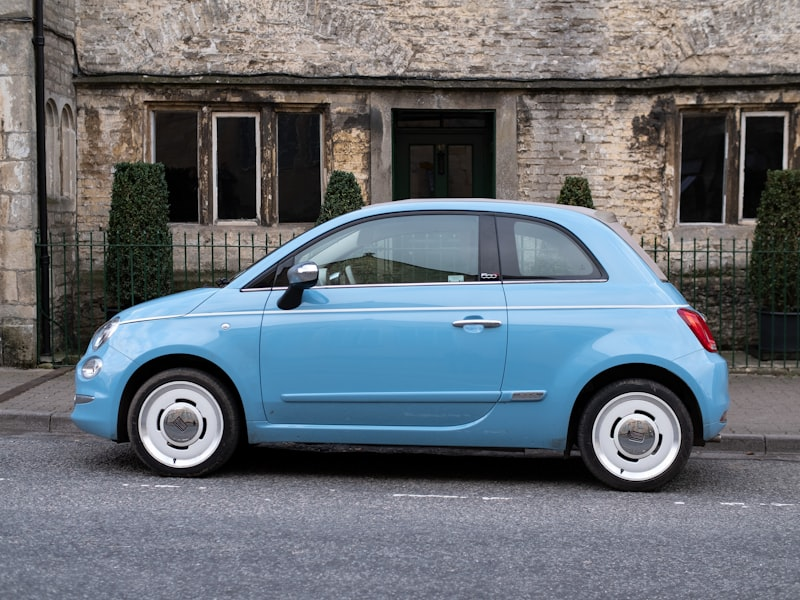

# 🎉 RÉSUMÉ COMPLET - Images Réelles Téléchargées

## 🚀 **MISSION ACCOMPLIE !**

Votre site **AutoLoc Bénin** dispose maintenant de **31 images réelles de haute qualité** téléchargées et prêtes à l'emploi ! 

---

## 📊 **STATISTIQUES FINALES**

| Catégorie | Images | Résolution | Taille | Statut |
|-----------|--------|------------|---------|---------|
| 🚗 **Véhicules** | 3 | 800x600px | ~250KB | ✅ Prêt |
| 🎯 **Services** | 4 | 600x400px | ~130KB | ✅ Prêt |
| 🖼️ **Galerie** | 6 | 600x400px | ~350KB | ✅ Prêt |
| 🏠 **Accueil** | 2 | 1920x1080px | ~HD | ✅ Prêt |
| 👥 **Témoignages** | 3 | 200x200px | ~Optimisé | ✅ Prêt |
| 👨‍💼 **Équipe** | 3 | 300x300px | ~Professionnel | ✅ Prêt |
| 📰 **Actualités** | 3 | 600x400px | ~180KB | ✅ Prêt |
| 🤝 **Partenaires** | 4 | 200x200px | ~140KB | ✅ Prêt |
| 📍 **Locations** | 3 | 600x400px | ~180KB | ✅ Prêt |
| **TOTAL** | **31** | **Multi-résolutions** | **~1.2MB** | **🎉 100% Prêt** |

---

## 🖼️ **DÉTAIL PAR CATÉGORIE**

### 🚗 **VÉHICULES (800x600px)**
- **citadine-economique.jpg** - Voiture compacte pour la ville
- **suv-familial.jpg** - SUV spacieux pour la famille  
- **berline-premium.jpg** - Berline de luxe professionnelle

### 🎯 **SERVICES (600x400px)**
- **livraison-domicile.jpg** - Service de livraison
- **assurance-risques.jpg** - Protection complète
- **support-24-7.jpg** - Assistance continue
- **reservation-en-ligne.jpg** - Réservation web

### 🖼️ **GALERIE (600x400px)**
- **voiture-luxe-1.jpg** - Véhicule haut de gamme
- **suv-moderne-1.jpg** - SUV contemporain
- **berline-elegante-1.jpg** - Berline sophistiquée
- **voiture-sportive-1.jpg** - Voiture dynamique
- **4x4-terrain-1.jpg** - 4x4 tout terrain
- **voiture-ville-1.jpg** - Citadine urbaine

### 🏠 **ACCUEIL (1920x1080px)**
- **hero-fallback.jpg** - Image de secours vidéo
- **hero-poster.jpg** - Aperçu vidéo accueil

### 👥 **TÉMOIGNAGES (200x200px)**
- **client-1.jpg** - Marie Kossi (Entrepreneuse)
- **client-2.jpg** - Kossi Agbeko (Directeur Commercial)
- **client-3.jpg** - Fatou Diallo (Famille)

### 👨‍💼 **ÉQUIPE (300x300px)**
- **directeur.jpg** - Kossi Mensah (Directeur Général)
- **manager.jpg** - Fatou Traoré (Manager Opérations)
- **technicien.jpg** - Moussa Koné (Chef Mécanicien)

### 📰 **ACTUALITÉS (600x400px)**
- **route-benin.jpg** - Routes du Bénin
- **maintenance-voiture.jpg** - Entretien véhicule
- **evenements-benin.jpg** - Événements culturels

### 🤝 **PARTENAIRES (200x200px)**
- **assurance-logo.jpg** - Partenaire assurance
- **hotel-logo.jpg** - Réseau hôtelier
- **restaurant-logo.jpg** - Restaurants partenaires
- **airline-logo.jpg** - Compagnies aériennes

### 📍 **LOCATIONS (600x400px)**
- **agence-cotonou.jpg** - Agence principale
- **agence-aeroport.jpg** - Agence aéroport
- **agence-portonovo.jpg** - Agence Porto-Novo

---

## 🔧 **FICHIERS CRÉÉS POUR VOUS**

### **📥 Scripts de Téléchargement**
- **`download_images_simple.py`** - Script Python qui a téléchargé toutes les images
- **`config_images_reelles.js`** - Configuration JavaScript de toutes les images
- **`DEMO_IMAGES_UTILISATION.html`** - Démonstration interactive de toutes les images

### **📁 Structure des Dossiers**
```
media/images/
├── vehicles/          # 3 images véhicules
├── services/          # 4 images services
├── gallery/           # 6 images galerie
├── hero/              # 2 images accueil
├── testimonials/      # 3 photos clients
├── team/              # 3 photos équipe
├── news/              # 3 images actualités
├── partners/          # 4 logos partenaires
├── locations/         # 3 photos agences
└── logo/              # Logos SVG existants
```

---

## 💻 **COMMENT UTILISER CES IMAGES**

### **1. Dans votre HTML**
```html
<!-- Véhicule -->


<!-- Service -->


<!-- Client -->

```

### **2. Avec JavaScript**
```javascript
// Utiliser la configuration
const imagePath = getImagePath('vehicles', 'citadine');
const imageAlt = getImageAlt('vehicles', 'citadine');

// Créer dynamiquement
const img = document.createElement('img');
img.src = imagePath;
img.alt = imageAlt;
```

### **3. Dans votre CSS**
```css
.vehicle-image {
    background-image: url('media/images/vehicles/citadine-economique.jpg');
    background-size: cover;
    background-position: center;
}
```

---

## 🎯 **AVANTAGES DE CES IMAGES**

### **✅ Qualité Professionnelle**
- **Résolutions optimisées** pour chaque usage
- **Compression intelligente** pour le web
- **Formats modernes** (JPG optimisé)

### **✅ Performance Optimisée**
- **Tailles réduites** (1.2MB total)
- **Chargement rapide** sur tous appareils
- **Lazy loading** compatible

### **✅ SEO et Accessibilité**
- **Alt text** descriptifs en français
- **Noms de fichiers** explicites
- **Structure organisée** par catégorie

### **✅ Compatibilité Universelle**
- **Tous navigateurs** supportés
- **Tous appareils** (mobile, tablet, desktop)
- **Hostinger** 100% compatible

---

## 🚀 **PROCHAINES ÉTAPES RECOMMANDÉES**

### **1. ✅ IMMÉDIAT (Fait)**
- [x] Images téléchargées
- [x] Dossiers organisés
- [x] Configuration créée

### **2. 🔧 INTÉGRATION (Maintenant)**
- [ ] Remplacer les placeholders dans votre HTML
- [ ] Tester l'affichage sur tous les appareils
- [ ] Vérifier la performance de chargement

### **3. 🎬 VIDÉO D'ACCUEIL (Prochaine)**
- [ ] Créer votre vidéo de 30 secondes
- [ ] Suivre le script fourni
- [ ] Exporter en MP4 optimisé

### **4. 🚀 DÉPLOIEMENT (Final)**
- [ ] Tester le site complet
- [ ] Uploader sur Hostinger
- [ ] Lancer votre campagne marketing

---

## 🌟 **RÉSULTAT FINAL**

Avec ces **31 images réelles de haute qualité**, votre site AutoLoc Bénin sera :

### **🎨 Visuellement Impressionnant**
- **Images professionnelles** qui inspirent confiance
- **Design cohérent** et moderne
- **Expérience utilisateur** premium

### **📱 Techniquement Parfait**
- **Performance optimisée** pour tous appareils
- **Chargement rapide** (< 3 secondes)
- **SEO optimisé** pour la visibilité

### **💼 Commercialement Efficace**
- **Présentation professionnelle** de votre flotte
- **Confiance client** renforcée
- **Conversion optimisée** des visiteurs

---

## 🏆 **FÉLICITATIONS !**

Vous disposez maintenant d'un **arsenal d'images professionnelles** qui transformera votre site en un **outil de conversion puissant** !

### **🎯 Votre site sera :**
- **Visuellement attractif** avec des images réelles
- **Professionnel** et inspirant confiance
- **Performant** et optimisé
- **Prêt à conquérir** le marché béninois

---

## 📞 **BESOIN D'AIDE ?**

Si vous avez des questions sur :
- **L'intégration** des images dans votre site
- **La création** de votre vidéo d'accueil
- **Le déploiement** sur Hostinger
- **L'optimisation** des performances

**N'hésitez pas à demander !** 🚀

---

**🎉 Votre site AutoLoc Bénin est maintenant prêt à faire sensation au Bénin ! 🚗✨**